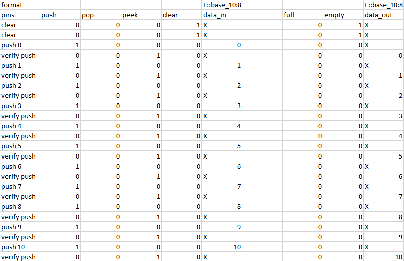

# VHDL Stack
Dieses Dokument dient als Übersicht der erbrachten Leistungen innerhalb des zweiten VHDL-Projektes.

## Angepasster Test-Preprocessor

Das im ersten VHDL Projekt erstellte C\#/.NET Programm, welches zur vereinfachten Erstellung von Testvektoren gedient hat, wurde nun erweitert und erneut genutzt. Die bestehende Implementierung sorgt dafür, dass Testvektoren zusammen mit Kommentaren in einer CSV Datei festgehalten werden können und die Input- und Output-Daten dann durch das Programm in separate TXT Dateien kopiert werden. Jegliche Kommentare (definiert durch die Position in der Datei) werden bei dem Kopiervorgang ignoriert. Somit kann die Übersichtlichkeit beim Schreiben der Testdaten gewährleistet werden.

Die Implementierung war ausreichend um den Stopwatch-Controller in Projekt 1 zu testen, jedoch ist eine Erweiterung des Programms nötig damit es auch für die höhere Anzahl von Testvektoren bei der Stack Implementierung nützlich sein kann. Es soll die Möglichkeit einer automatischen Konvertierung zwischen Zahlensystemen eingebaut werden um nicht auf die binäre Representation von Zahlen in den Testvektoren beschränkt zu sein. 
Zusätzlich soll eine Syntax zur Markierung von Don't Cares eingefügt werden, über die das Programm die benötigten Bits für die Testbench ebenfalls als Don't Cares notiert.
Die neue, damit einhergehende Struktur der Daten innerhalb der CSV Datei wird im folgenden definiert.

### CSV Struktur
Damit das C\#-Programm die Testdaten erfolgreich verarbeiten kann, wird der Aufbau der CSV Datei wie folgt vorgeschrieben:
- Die erste Zeile beinhaltet Definitionen der verwendeten Zahlensysteme und Wortbreiten für die jeweiligen Spalten in denen sie stehen. Entweder werden sowohl Zahlensystem als auch Wortbreite definiert, oder es wird keine Definition angegeben.
    - Die Syntax einer Spaltendefinition lautet wie folgt: "F::base_[Basis_Zahlensystem]:[Wortbreite]". Beispiel: Wenn die Werte der Spalte im Dezimalsystem angegeben werden und jeweils 8 Bits generiert werden sollen, muss die Definition wie folgt lauten: "F::base_10:8".
    - Wenn der Inhalt einer Spalte nicht definiert wird, ist angenommen, dass der Spalteninhalt immer genau ein Bit repräsentiert.
- Die erste Spalte kann für Kommentare o.Ä. verwendet werden. (Die Spaltendefinitionen fangen erst ab Spalte 2 an!)
- Die zweite Zeile kann für Kommentare o.Ä. verwendet werden.
- Die Input-Daten fangen ab Zeile 3 Spalte 2 an. Für jedes Input-Feld wird eine neue Spalte hinzugefügt.
- Die Output-Daten werden durch eine leere Spalte von den Input-Daten getrennt. Für jedes Output-Feld wird eine neue Spalte hinzugefügt.
- Ein Input-Output-Datenpaar steht in einer Zeile.

Der erwartete Inhalt der Input- und Output-Abschnitte kann sich wie oben erwähnt von Spalte zu Spalte ändern. Entweder werden Werte einer Spalte passend zu der Definition der Spalte, oder, falls keine Definition vorhanden, ein Bit erwartet.
Unabhängig von der Spaltendefinition kann IMMER ein "X" in einer Zelle stehen, welches als Don't Care interpretiert wird. 

Der folgende Bildschirmausschnitt veranschaulicht die oben beschriebene Struktur anhand eines Beispiels mit 12 Input-Feldern und 10 Output-Feldern. Die letzten 8 Input-Felder werden in Spalte F zusammengefasst und sind im Dezimalsystem notiert. Das gleiche gilt für die letzten 8 Output-Felder in Spalte J. **(1)**


### TXT Struktur
Pro CSV Datei werden zwei TXT Dateien erstellt. Eine Datei beinhaltet die Input-Felder und eine Datei beinhaltet die Output-Felder. Daten in verschiedenen Spalten werden durch Leerzeichen separiert. Die Daten werden unter Beeinhaltung der angegebenen Reihenfolge kopiert, jedoch wird der letzte Input-Datensatz, sowie der erste Output-Datensatz zwei Mal eingefügt, da die Zustandsänderung um einen Takt nach hinten verschoben ist.

Die generierten Dateien passend zu Beispiel **(1)** sehen wie folgt aus:

*tb-inputs.txt*
```
0 0 0 1 --------
0 0 0 1 --------
1 0 0 0 00000000
0 0 1 0 --------
1 0 0 0 00000001
0 0 1 0 --------
1 0 0 0 00000010
0 0 1 0 --------
1 0 0 0 00000011
0 0 1 0 --------
1 0 0 0 00000100
0 0 1 0 --------
1 0 0 0 00000101
0 0 1 0 --------
1 0 0 0 00000110
0 0 1 0 --------
1 0 0 0 00000111
0 0 1 0 --------
1 0 0 0 00001000
0 0 1 0 --------
1 0 0 0 00001001
0 0 1 0 --------
1 0 0 0 00001010
0 0 1 0 --------
0 0 1 0 --------
```

*tb-expected.txt*
```
- - --------
0 1 --------
0 1 --------
0 0 --------
0 0 00000000
0 0 --------
0 0 00000001
0 0 --------
0 0 00000010
0 0 --------
0 0 00000011
0 0 --------
0 0 00000100
0 0 --------
0 0 00000101
0 0 --------
0 0 00000110
0 0 --------
0 0 00000111
0 0 --------
0 0 00001000
0 0 --------
0 0 00001001
0 0 --------
0 0 00001010
```

