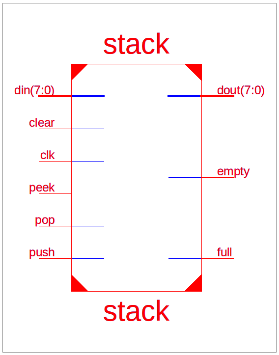

# VHDL Stack - Datenblatt 

_Gruppe: Ben Bekir Ertugrul, Frederik Höft, Manuele Waldheim und Henri Betz_

Dieses Dokument liefert eine kurze technische Übersicht des VHDL Stacks.

## Eigenschaften

Der Stack arbeitet mit einer internen, verwendbaren Adressbreite von 8 Bit. Dies entspricht einer maximalen Stackgröße von 256 Elementen. Die Wortbreite der Datenwörter beträgt ebenso 8 Bit. Die maximale Taktfrequenz wurde mit Xilinx ISE für Xilinx Spartan-3E (XC3S500E-VQ100) FPGAs durch Post-Route-Timing Analysen ermittelt und liegt für den Stack bei 155.715 MHz, bzw 6.422 ns pro Taktzyklus. Der erwartete gesamt-Stromverbraucht beträgt 105.20 mW. Weitere Informationen zur Leistungsaufnahme sind in der Tabelle "Power Consumption" zu finden.

## Portübersicht

Die zur Verfügung stehenden Ports sind in der folgenden Tabelle abgebildet. Alle Pins sind high-aktiv.

| Typ | Name | Beschreibung | Wortbreite |
|-|-|-|-|-|
| In | clk | Clock ($f <$ 155.715 MHz) | 1 |
| In | push | Push word from `din` onto stack (**requires:** $\neg$ full) | 1 |
| In | pop | Pop word from stack to `dout` (**requires:** $\neg$ empty) | 1 |
| In | clear | Clear stack, set stack pointer to 0, sets `full = 0`, sets `empty = 1` | 1 |
| In | (peek/reserved) | Legacy Peek Operation, reserved for future use, nicht angeschlossen. Siehe Hinweis. $\neg$ push $\land\neg$ clear $\land \neg$ empty $\implies$ peek. Sets `dout` to last-written data word. | 1 |
| In | din | Data Input | 8 |
| Out | dout | Data Output | 8 |
| Out | full | Full Flag. While the stack is full (max capacity has been reached) any further attempts to push data will be ignored. | 1 |
| Out | empty | Empty Flag. While the stack is empty (no data has been pushed yet) any further attempts to pop or peek data will be ignored. The value of `dout` is undefined in these cases. | 1 |

Hinweis:

Der "Peek"-Pin ist eine nicht angeschlossene abwärtskompatible Schnittstelle. Im Rahmen der finalen Optimierungsphase wurde dieser Pin aus dem Design optimiert und dient jetzt ausschließlich Kompatibilitätszwecken mit dem Testbench. ZU beachten ist, dass "Peek" jetzt die Standardoperation ist, wenn sowohl "Push" als auch "Clear" auf 0 gesetzt sind ("Pop" impliziert auch "Peek"). Der tatsächliche Pegel am "Peek"-Pin ist irrelevant, da er nicht angeschlossen ist. Hierbei sei darauf hingewiesen, dass in jedem Fall die "Peek" Operation nur ausgeführt wird, wenn der Stack nicht leer ist. Anderenfalls sind die Ausgangsdaten (`dout`) undefiniert.

Der Peek-Pin dient somit ausschließlich der Kompatibilität mit der Testbench und als mögliche zukünftige Erweiterung des Stacks (reserved for future use).

### Steuersignalverhalten

Je nach Kombination der Steuersignale wird eine bestimmte Operation ausgeführt. Die folgende Tabelle zeigt das Verhalten des Stacks bei den verschiedenen (ggf. überlappenden) Steuersignalen.

| push | pop | clear | (peek/reserved) | Verhalten |
|-|-|-|-|-|
| 0 | 0 | 0 | - | Peek Operation, falls Stack nicht leer, sonst NOP |
| - | - | 1 | - | Clear Operation, Stack Pointer wird auf 0 gesetzt |
| 0 | 1 | 0 | - | Pop Operation, falls Stack nicht leer, sonst NOP |
| 1 | - | 0 | - | Push Operation, falls Stack nicht voll, sonst NOP |

## Power Consumption

|        On-Chip        | Power (mW) |  Used  | Available | Utilization (%) |
|-----------------------|------------|--------|-----------|-----------------|
| Clocks                |       2.82 |      1 |    ---    |       ---       |
| Logic                 |       0.51 |     33 |      9312 |               0 |
| Signals               |       0.74 |     60 |    ---    |       ---       |
| IOs                   |      18.63 |     22 |        66 |              33 |
| BRAMs                 |       0.52 |      1 |        20 |               5 |
| Static Power          |      81.99 |        |           |                 |
| Total                 |     105.20 |        |           |                 |