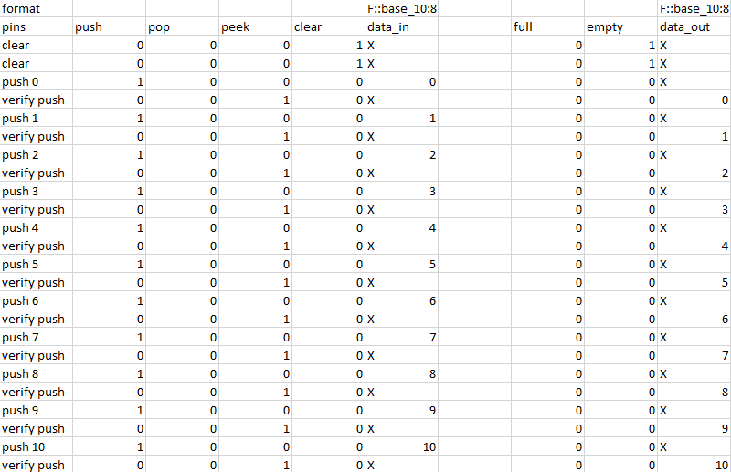
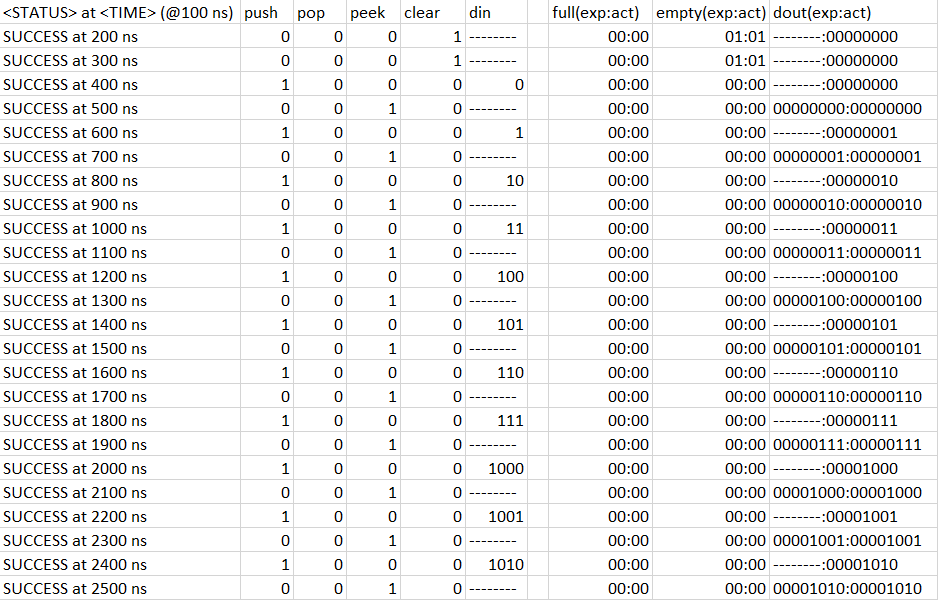

# VHDL Stack

Dieses Dokument dient als Übersicht der erbrachten Leistungen innerhalb des zweiten VHDL-Projektes.

## Beschreibung des Stacks

Es wurde ein Stack in VHDL implementiert, welcher 256x8 Bit abspeichern kann. Es ist möglich Daten auf den Stack zu pushen, von dem Stack zu poppen, oder den zuletzt gepushten Wert auszulesen (peek). Außerdem kann der Inhalt des Stacks zurückgesetzt werden. Wenn der Stack `empty` oder vollgeschrieben ist, wird das entsprechende Output Flag gesetzt. Der Benutzer des Stacks muss selbst sicherstellen, dass er, wenn der Stack `empty` ist, nicht mehr die pop-Operation ausführt und, wenn der Stack voll ist, nicht mehr die push-Operation ausführt. Versucht er es dennoch, werden die Operationen ignoriert.

Die zur Verfügung stehenden Ports sind in der folgenden Tabelle abgebildet. Alle Pins sind high-aktiv.

| Typ | Name | Beschreibung | Wortbreite |
|-|-|-|-|-|
| In | clk | Clock | 1 |
| In | push | Push Operation | 1 |
| In | pop | Pop Operation | 1 |
| In | clear | Clear Operation | 1 |
| In | peek | Peek Operation | 1 |
| In | din | Data In | 8 |
| Out | dout | Data Out | 8 |
| Out | full | Full Flag | 1 |
| Out | empty | Empty Flag | 1 |

Eine detaillierte Beschreibung des Verhaltens inklusive Besonderheiten und Blockschaltbild befindet sich in dem beigelegten Datenblatt.

### Implementierungsdetails / Besonderheiten

Die Realisierung des 256x8-Bit-Stacks erfolgt in VHDL. Der Stack wird durch einen 512x8-Bit-Single-Point-Block SelectRAM umgesetzt, der durch einen 9-Bit-Adressbus adressiert wird. Den einzigen "Zustand" des Stacks bildet ein 9-Bit-Stack-Pointer, der auf die nächste freie Adresse verweist, sodass es sich bei der Implementierung nicht um einen endlichen Automaten im klassischen Sinne (mit gesonderter Zustandsverwaltung) handelt. Je nach Operation wird dieser Stack-Pointer dynamisch über einen MUX direkt oder mit dekrementiertem Wert an den RAM Addressbus angelegt. 

Gleichzeitig dient das MSB des 9 Bit Stack-Pointers (MSB = 1 $\iff$ Stack-Pointer > 255) als `full`-Flag, welches signalisiert, wenn der Stack voll ist. In diesem Fall wird der Stack-Pointer nicht weiter als 256 inkrementiert und weitere Push-Operationen ignoriert. Über das MSB werden Overflows des Stack-Pointers somit sicher erkannt, ohne dass es zu "echten" Überläufen der 9-Bit-Adresse kommt.

Ebenso existiert ein `empty`-Flag, das gesetzt wird, wenn der Stack-Pointer 0 beträgt. Dieses interne Flagsystem basiert ausschließlich auf dem Stack-Pointer, sodass flags asynchron aktualisiert werden können, sodass die Anzahl der Flip-Flops minimiert werden kann.

Vier Eingänge stehen zur Verfügung: `push`, `pop`, `clear` und `din`. Über das `push`-Signal können 8-Bit Datenwörter vom `din` Eingang an die aktuelle Adresse des Stack-Pointers geschrieben werden, wobei nach dem Schreiben der Stack-Pointer inkrementiert wird. Das `pop`-Signal liest das Datenwort an der Adresse des aktuellen Stack-Pointers minus 1 aus und dekrementiert dann den Stack-Pointer. Dies liegt daran, dass der Stack-Pointer auf die nächste freie Adresse zeigt, und das zuletzt gepushte Element an der Adresse des aktuellen Stack-Pointers minus 1 liegt. Das ausgelesene Datenwort wird an den `dout`-Ausgang weitergeleitet. Das `clear`-Signal setzt den Stack-Pointer auf 0, wodurch automatisch die `full` und `empty`-Flags entsprechend aktualisiert werden.  Der nicht mehr verwendete `peek`-Eingang wurde bei der finalen Timing-Optimierung aus dem Design entfernt und besteht inzwischen lediglich aus Gründen der Abwärtskompatibilität mit der Testbench. Das finale Design sieht vor, dass die Peek-Operation standardmäßig ausgeführt wird, wenn `push`, `clear` und `empty` gleichzeitig 0 sind. In diesem Fall wird das zuletzt gepushte Element an den `dout`-Ausgang weitergeleitet.

Werden mehrere Eingänge gleichzeitig gesetzt, werden die Operationen in der folgenden Reihenfolge evaluiert: `clear` > `push` > `pop`/`peek`.

Die Ausgänge `full` und `empty` stellen die internen flags zur Verfügung. 

Die Adress-Multiplexer-Logik ist ebenfalls asynchron, um RAM-Zugriffe im selben Zyklus zu ermöglichen (wobei eine kurze Setup Zeit benötigt wird). Diese Logik verwendet das `push` Signal und die internen Flags als Steuersignale, um die zu übermittelnde Adresse an den RAM zu bestimmen. Hierbei wird der Stackpointer direkt an den RAM angelegt, wenn `push` oder `empty` gesetzt sind (wenn also das nächste Element geschrieben werden soll, oder der Stack leer ist, also ein `pop`/`peek` unmöglich ist). Andernfalls wird der Stackpointer dekrementiert, um das zuletzt gepushte Element zu lesen.

Zustandsübergänge des Stack-Pointers erfolgen synchron zum Takt und werden durch die `push`, `pop` und `clear`-Inputs, sowie die aktuellen Flags (also den aktuellen Stack-Pointer-Wert) gesteuert. Hierbei wird der Stack-Pointer inkrementiert, wenn `push` und gesetzt ist und der Stack noch nicht voll ist, bzw. dekrementiert, wenn `pop` gesetzt ist und der Stack nicht leer ist. Der Stack-Pointer wird auf 0 gesetzt, wenn `clear` gesetzt ist. Die Flags werden asynchron direkt basierend auf dem aktuellen Stack-Pointer aktualisiert, um die Anzahl der Flip-Flops zu minimieren und Inkonsistenzen auszuschließen.

## Angepasster Test-Preprocessor

Das im ersten VHDL Projekt erstellte C\#/.NET Programm, welches zur vereinfachten Erstellung von Testvektoren gedient hat, wurde nun erweitert und erneut genutzt. Die bestehende Implementierung sorgt dafür, dass Testvektoren zusammen mit Kommentaren in einer CSV Datei festgehalten werden können und die Input- und Output-Daten dann durch das Programm in separate TXT Dateien kopiert werden. Jegliche Kommentare (definiert durch die Position in der Datei) werden bei dem Kopiervorgang ignoriert. Somit kann die Übersichtlichkeit beim Schreiben der Testdaten gewährleistet werden.

Die Implementierung war ausreichend um den Stopwatch-Controller in Projekt 1 zu testen, jedoch ist eine Erweiterung des Programms nötig damit es auch für die höhere Anzahl von Testvektoren bei der Stack Implementierung nützlich sein kann. Es soll die Möglichkeit einer automatischen Konvertierung zwischen Zahlensystemen eingebaut werden um nicht auf die binäre Representation von Zahlen in den Testvektoren beschränkt zu sein. 
Zusätzlich soll eine Syntax zur Markierung von Don't Cares eingefügt werden, über die das Programm die benötigten Bits für die Testbench ebenfalls als Don't Cares notiert.
Die neue, damit einhergehende Struktur der Daten innerhalb der CSV Datei wird im folgenden definiert.

### CSV Struktur

Damit das C\#-Programm die Testdaten erfolgreich verarbeiten kann, wird der Aufbau der CSV Datei wie folgt vorgeschrieben:
- Die erste Zeile beinhaltet Definitionen der verwendeten Zahlensysteme und Wortbreiten für die jeweiligen Spalten in denen sie stehen. Entweder werden sowohl Zahlensystem als auch Wortbreite definiert, oder es wird keine Definition angegeben.
    - Die Syntax einer Spaltendefinition lautet wie folgt: "F::base_[Basis_Zahlensystem]:[Wortbreite]". Beispiel: Wenn die Werte der Spalte im Dezimalsystem angegeben werden und jeweils 8 Bits generiert werden sollen, muss die Definition wie folgt lauten: "F::base_10:8".
    - Wenn der Inhalt einer Spalte nicht definiert wird, ist angenommen, dass der Spalteninhalt immer genau ein Bit repräsentiert.
- Die erste Spalte kann für Kommentare o.Ä. verwendet werden. (Die Spaltendefinitionen fangen erst ab Spalte 2 an!)
- Die zweite Zeile kann für Kommentare o.Ä. verwendet werden.
- Die Input-Daten fangen ab Zeile 3 Spalte 2 an. Für jedes Input-Feld wird eine neue Spalte hinzugefügt.
- Die Output-Daten werden durch eine leere Spalte von den Input-Daten getrennt. Für jedes Output-Feld wird eine neue Spalte hinzugefügt.
- Ein Input-Output-Datenpaar steht in einer Zeile.

Der erwartete Inhalt der Input- und Output-Abschnitte kann sich wie oben erwähnt von Spalte zu Spalte ändern. Entweder werden Werte einer Spalte passend zu der Definition der Spalte, oder, falls keine Definition vorhanden, ein Bit erwartet.
Unabhängig von der Spaltendefinition kann IMMER ein "X" in einer Zelle stehen, welches als Don't Care interpretiert wird. 

Der folgende Bildschirmausschnitt veranschaulicht die oben beschriebene Struktur anhand eines Beispiels mit 12 Input-Feldern und 10 Output-Feldern. Die letzten 8 Input-Felder werden in Spalte F zusammengefasst und sind im Dezimalsystem notiert. Das gleiche gilt für die letzten 8 Output-Felder in Spalte J. **(1)**


### TXT Struktur

Pro CSV Datei werden zwei TXT Dateien erstellt. Eine Datei beinhaltet die Input-Felder und eine Datei beinhaltet die Output-Felder. Daten in verschiedenen Spalten werden durch Leerzeichen separiert. Die Daten werden unter Beeinhaltung der angegebenen Reihenfolge kopiert, jedoch wird der letzte Input-Datensatz, sowie der erste Output-Datensatz zwei Mal eingefügt, da die Zustandsänderung um einen Takt nach hinten verschoben ist.

Die generierten Dateien passend zu Beispiel **(1)** sehen wie folgt aus:

*tb-inputs.txt*
```
0 0 0 1 --------
0 0 0 1 --------
1 0 0 0 00000000
0 0 1 0 --------
1 0 0 0 00000001
0 0 1 0 --------
1 0 0 0 00000010
0 0 1 0 --------
1 0 0 0 00000011
0 0 1 0 --------
1 0 0 0 00000100
0 0 1 0 --------
1 0 0 0 00000101
0 0 1 0 --------
1 0 0 0 00000110
0 0 1 0 --------
1 0 0 0 00000111
0 0 1 0 --------
1 0 0 0 00001000
0 0 1 0 --------
1 0 0 0 00001001
0 0 1 0 --------
1 0 0 0 00001010
0 0 1 0 --------
0 0 1 0 --------
```

*tb-expected.txt*
```
- - --------
0 1 --------
0 1 --------
0 0 --------
0 0 00000000
0 0 --------
0 0 00000001
0 0 --------
0 0 00000010
0 0 --------
0 0 00000011
0 0 --------
0 0 00000100
0 0 --------
0 0 00000101
0 0 --------
0 0 00000110
0 0 --------
0 0 00000111
0 0 --------
0 0 00001000
0 0 --------
0 0 00001001
0 0 --------
0 0 00001010
```

## Implementierung der Testbench

Die für das letzte Projekt genutzte Testbench wurde nun so erweitert, dass sie auch die neuen Input- und Output-Pins auswerten kann. Außerdem wurde die Generation einer ausführlichen Log-Datei im CSV-Format dem Testvorgang hinzugefügt, welche den Status des Tests, zusammen mit den getesteten Daten aufführt. Dies bietet einen deutlich detaillierteren Output im Gegensatz zu der Basisimplementierung und sorgt vor allem dafür, dass Fehler in der Implementation schneller beseitigt werden konnten. Zudem wird die CSV Tabelle so formatiert, dass der Input und Output/Expected-Wert der Testvektoren direkt nebeneinander steht (der delay wird also automatisch ausgeglichen), was die Übersichtlichkeit der Testergebnisse deutlich erhöht.

Die generierte Log-Datei passend zu Beispiel **(1)** sieht wie folgt aus:
